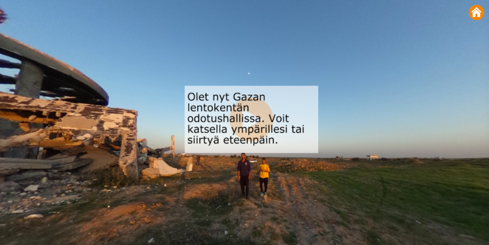
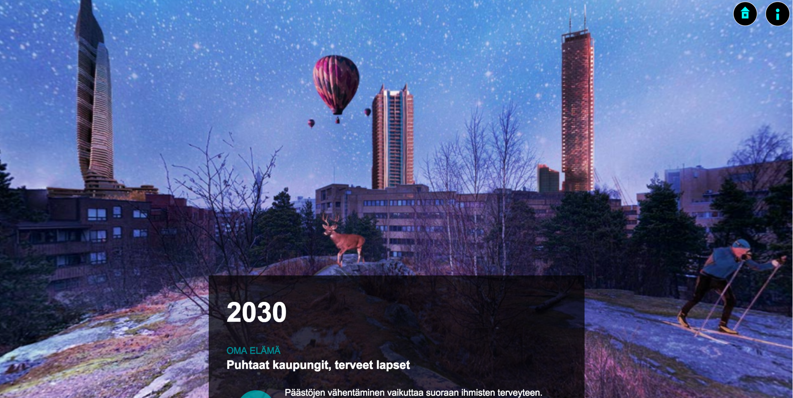
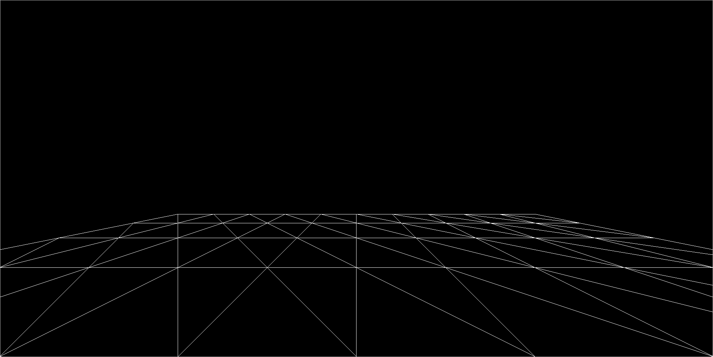
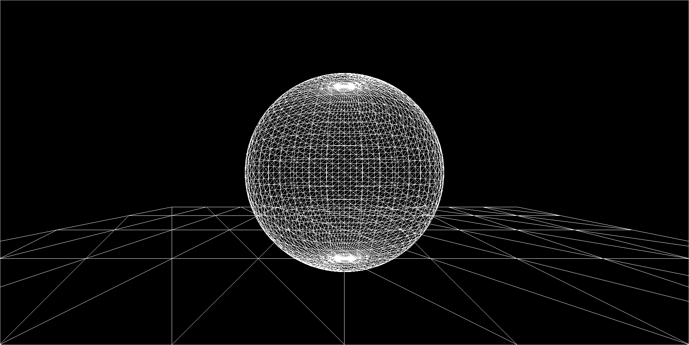
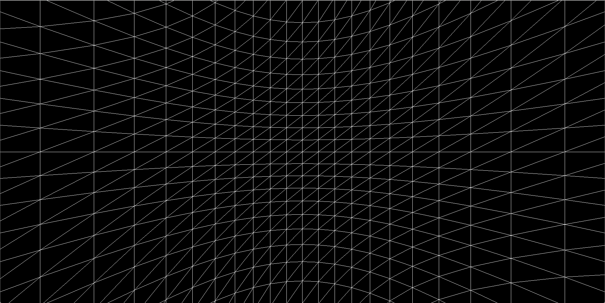
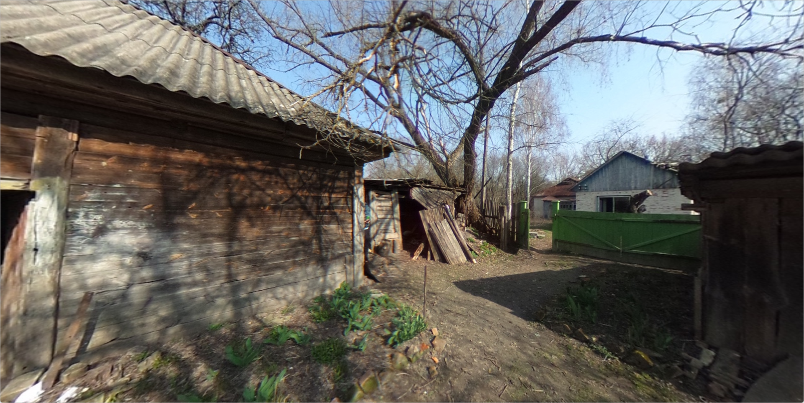
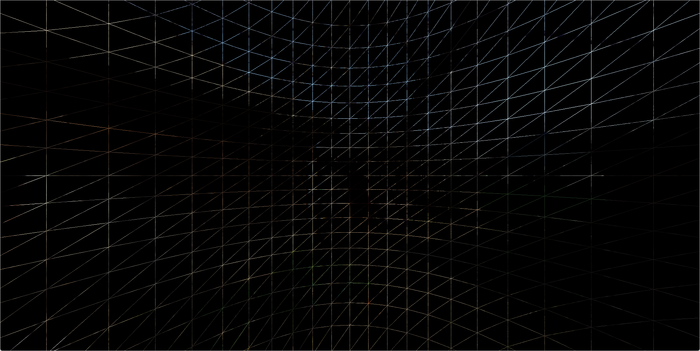

# Creating a Story in Virtual Reality

## Ville Juutilainen

- Journalist specialized in data and interactive web applications
- Working at Plus / Finnish Broadcasting Company
- Our team: 2 full-time coders (incl. me), 3 graphic designers, 2 producers (incl. team leader)
- Data-driven, interactive and experimental news content

## The backstory

- Planning special coverage leading to the 2015 United Nations Climate Change Conference
- From basic timelines and line graphs to "something different"
- Gathering climate scenario information on global and individual level
- Working with 360 images, making it work

## The result

- [Heading for Destruction or Salvation?](http://yle.fi/uutiset/8477206)

## ...few months later

- [Leap to Freedom](http://yle.fi/uutiset/8686254)

## Why?

- **Bleeding edge:** VR is the "next platform"
- **Learning:** Gathering experience on working in 3d 
- **Competing for attention:** Making people care

## Let's make something virtual

- Everything in the *"computer world"* is virtual?
- How about **virtual reality**?

*"An artificial world that consists of images and sounds created by a computer and that is affected by the actions of a person who is experiencing it."*
(Merriam-Webster)

## In the beginning...

## We are somewhere

## What do we have

- Camera
- Scene with a plane
- Rendering WebGL graphics with Three.js
- Responsive width and height

## More proof we're in 3D

## Inside the sphere

## 360 image as an inside texture

## Just a reminder

## What makes it sad

- **We have created an awesome virtual 3D world with a 360-textured sphere that runs on your web browser**
- Only we know about it

## Adding mouse controls

- Mouse movement in x and y
- Transform into latitude and longitude
- Set a target with x, y, z position based on latitude and longitude
- Set camera to look at the target

## Let's take a look

## Device orientation

## Now in stereo!

## Back to the story

- How do we refine the idea for virtual reality?
- **Environment**
- **Viewpoint**
- **Immersion**

## Environment

- What interesting environments reflect the story idea?
- Places of exclusive access
- Places rich in detail
- Environments that don't yet exist
- Imaginary environments

## Viewpoint

- First-person, adult or a child
- Bird's-eye (meaning you're the bird)
- 360 spheres: Selfie vs. remote shoot?
- 3D modeling: Modeling and changing the observer?

## Creating immersion

- Images
- Video
- 3d modeling
- Audio
- Text

## Actions

*"...artificial world ... that is affected by the actions of a person who is experiencing it."*

- Even just a little more than looking
- Interface inside the virtual space
- User interface outside the virtual space (the web page layout)

## What could happen?

- 3d models: Moving around freely
- Spheres: Transition from one scene to another
- Actions with results: newsgames

## Changing the scene

## Use your vision!

## What do we already know as writers?

- Who, what, when, where, why, how
- Show, don't tell
- First-person narrative
- Gonzo

## Why are we thrown into this world?

- Guiding the user
- Story goals
- Story means
- Story achievements

## Thinking about ethics

- What is too much for the user?
- Observing traumatizing events
- Participating in traumatizing events
- Could we need a safe button? Safe word?
- Result scenarios vs. reality

## About developer reality

- 360 spheres: Enough is enough
- 3D modeling: What is feasible?
- Modular, pluggable, newsworthy components
- Changing APIs, new devices, breaking changes

## The end

- Web: [villejuutilainen.net](http://www.villejuutilainen.net)
- Twitter: [@vjuutilainen](https://twitter.com/vjuutilainen)
